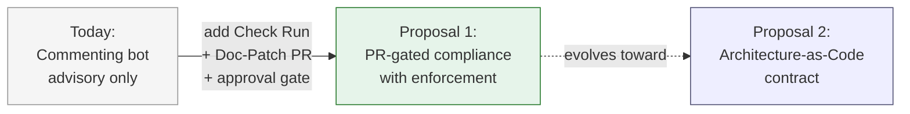
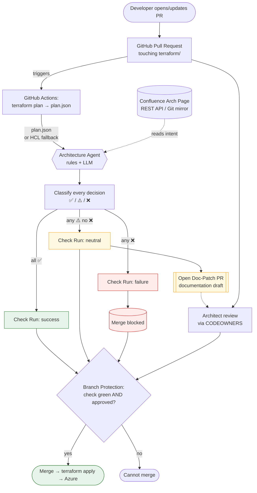
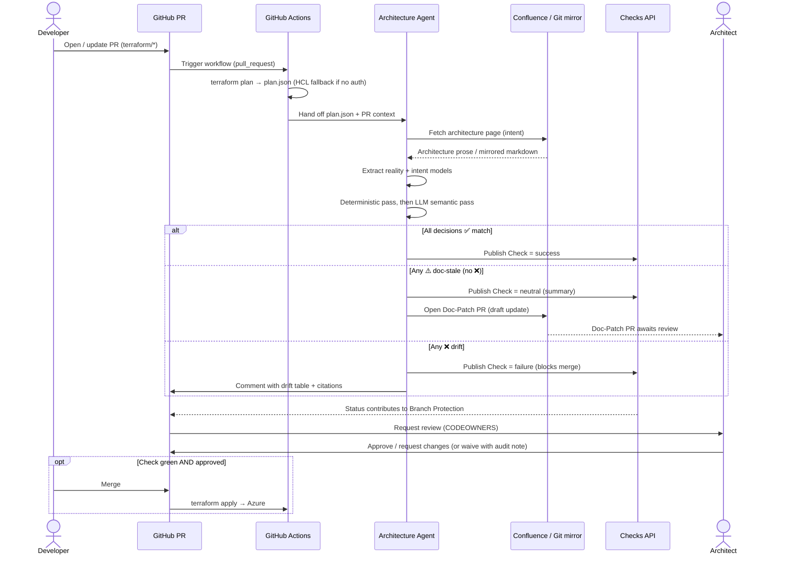
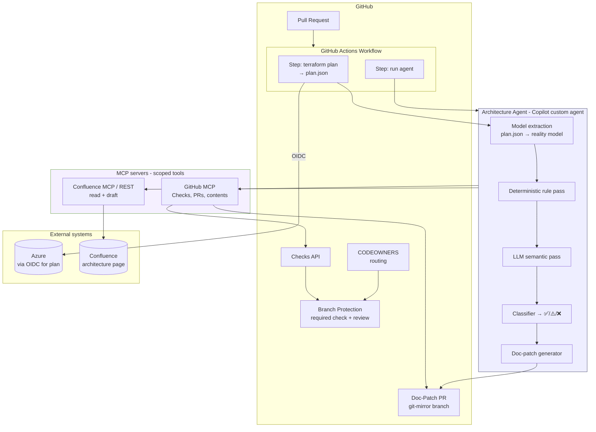
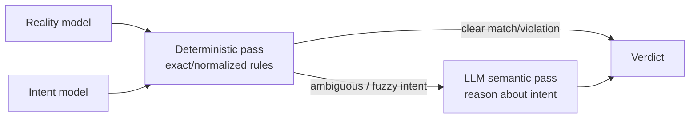
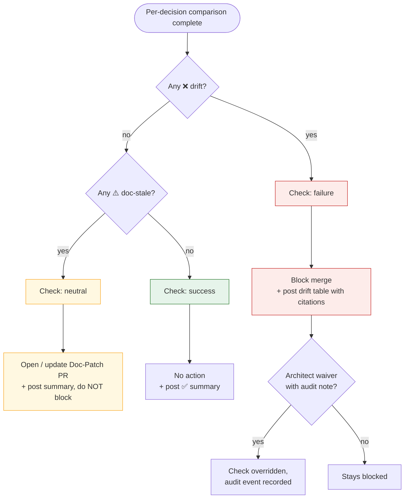
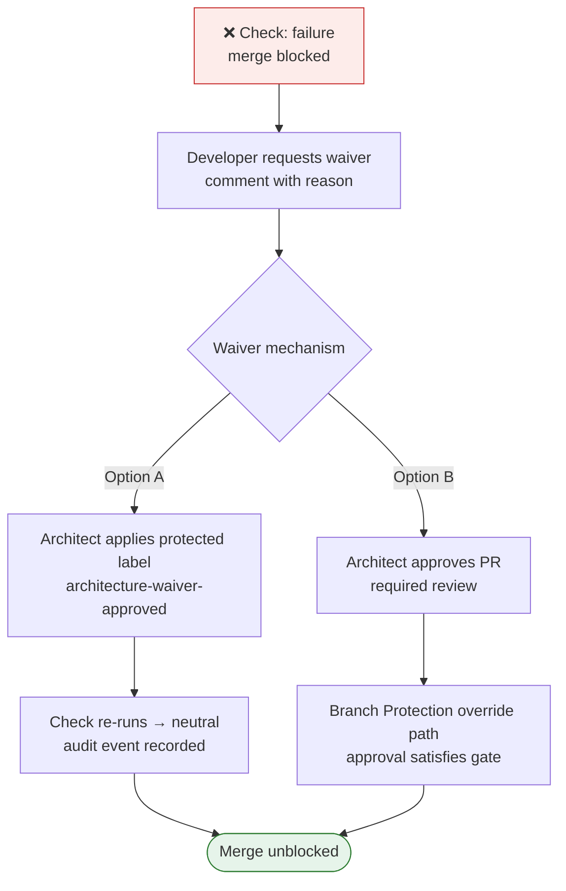
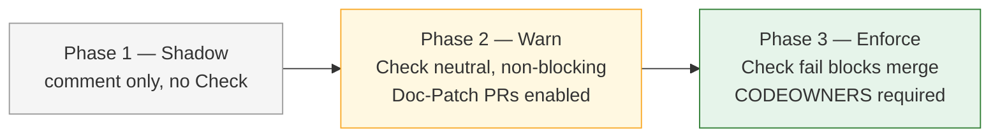

# Proposal 1 — PR-Gated Compliance Agent with Approval Gate & Doc-Patch PR

> **Deep-dive, end-to-end solution design.** This document expands
> [Proposal 1 in `e2e-solution.md`](e2e-solution.md#proposal-1--pr-gated-compliance-agent-with-approval-gate--doc-patch-pr)
> into a full high-level design: workflow, diagrams, and concepts. It is intentionally
> **design-only** — no workflow YAML, agent code, or scripts. It builds on the existing
> [`ArchitectureReviewerProposal.md`](ArchitectureReviewerProposal.md) concept and the
> working [`architecture-drift-review` skill](.github/skills/architecture-drift-review/SKILL.md).

---

## 1. Executive Summary

Today, the Architecture Compliance Agent is a **commenting bot**: on a Terraform Pull
Request it compares the code against a Confluence architecture page and posts findings as
a PR comment. Comments are advisory — nothing stops a drifting PR from merging, and the
documentation is never actually updated.

**Proposal 1 is the low-effort hardening of that agent.** It keeps the same core engine but
adds three things that turn advice into governance:

1. **A blocking quality gate** — the agent publishes a GitHub **Check Run** (`pass` /
   `neutral` / `fail`) that participates in **Branch Protection**. A hard drift **blocks
   merge**.
2. **Automated documentation remediation** — when the code is right but the docs are stale,
   the agent **opens a Doc-Patch PR** (or a Confluence draft) so the documentation catches
   up to reality, reviewed by a human before publish.
3. **A human approval step** — infra-affecting PRs are routed to the architecture team via
   **CODEOWNERS** / required reviewers before merge.

The delta from today is deliberately small — same model, same rubric, same LLM reasoning —
which is why this proposal is rated **low effort**. It is the natural first step and
composes cleanly toward the more strategic proposals (2–4).

---

## 2. Goals & Non-Goals

### Goals
- **Enforce architectural intent at PR time** with a merge-blocking check.
- **Keep humans in the loop** for both approvals (Architect sign-off) and doc updates.
- **Auto-remediate documentation drift** by drafting a change, never publishing silently.
- **Preserve segregation of duties** — the agent proposes; humans approve.
- **Reuse the existing engine** (model extraction + rubric) with minimal new machinery.

### Non-Goals (explicitly out of scope for Proposal 1)
- **Post-deploy / live reconciliation.** Drift is caught only when a PR runs. Divergence
  introduced out-of-band (ClickOps in the Azure Portal) is *not* detected here — that is
  Proposal 4's territory.
- **Architecture-as-Code contract.** Confluence prose stays the source of truth; we do not
  introduce a machine-readable `architecture.yaml` — that is Proposal 2.
- **Auto-fixing Terraform.** The agent does not rewrite infrastructure code; it flags and
  blocks. Autonomous code remediation is Proposal 3.
- **Replacing human architects.** The gate augments review; it does not remove it.

---

## 3. Concept Model — Intent vs Reality

The whole system rests on comparing two reduced models of the same system:

| Side | Source of truth | Represents | Extracted by |
|---|---|---|---|
| **Intent** | Confluence architecture page (prose) | What the architect *decided* | LLM reads the doc → simplified model |
| **Reality** | Terraform plan JSON (or HCL fallback) | What the code *deploys* | Deterministic parse → simplified model |

Both sides are reduced to the **same simplified architecture model** (see
[`architecture-model.md`](.github/skills/architecture-drift-review/references/architecture-model.md)),
so the comparison is **semantic, not syntactic**. Only architectural decisions are
captured — resource groups, compute SKU, database tier, networking/private endpoints,
public access, high availability, identity, security — not incidental detail like tags or
DNS records.

Comparison yields exactly **three outcomes** (the vocabulary matches the existing
[`comparison-rubric.md`](.github/skills/architecture-drift-review/references/comparison-rubric.md)
and the sample [`architecture-review.md`](architecture-review.md)):

- ✅ **Match** — Terraform satisfies the documented decision (semantically).
- ⚠️ **Documentation update needed** — Terraform adds/omits components the doc does not
  describe, without contradicting a hard rule. *The code is fine; the docs are stale.*
- ❌ **Drift** — Terraform contradicts a documented decision. *A hard rule is violated.*

These three outcomes drive three different automated actions, which is the heart of
Proposal 1.

---

## 4. End-to-End Workflow

### Narrative

1. A developer opens/updates a **Pull Request** that touches `terraform/`.
2. A **GitHub Actions** workflow runs `terraform plan` and produces `plan.json`
   (`terraform show -json`). If Azure auth is unavailable, it **falls back to parsing HCL**.
3. The **Architecture Agent** extracts the *reality* model from the plan and the *intent*
   model from the Confluence page (via REST API or a Git-mirrored copy).
4. The agent runs a **deterministic rule pass** followed by an **LLM semantic pass** and
   classifies every decision as ✅ / ⚠️ / ❌.
5. The agent maps the aggregate result to a **Check Run conclusion** and takes an action:
   - **All ✅ → Check `success`.** Nothing else required.
   - **Any ⚠️ (no ❌) → Check `neutral`** and **open a Doc-Patch PR** to update the docs.
   - **Any ❌ → Check `failure`**, which **blocks merge** via Branch Protection.
6. **CODEOWNERS** routes the infra PR to the architecture team for **approval**.
7. Merge is allowed only when the **check is green (or waived)** *and* an **Architect has
   approved**. On merge, the normal `terraform apply` pipeline deploys to Azure.

### Workflow diagram

---

## 5. Sequence Diagram

The full round-trip across actors, including the doc-patch branch and the approval gate:

---

## 6. Component / Architecture View

**Key components**
- **Workflow trigger** — `pull_request` on paths under `terraform/`.
- **Plan step** — `terraform init/validate/plan`, then `terraform show -json`; authenticates
  to Azure via **OIDC** (no long-lived secrets). Reuses the existing
  [`generate-plan-json` scripts](.github/skills/architecture-drift-review/scripts/).
- **Architecture Agent** — a **GitHub Copilot custom agent** wrapping the existing
  `architecture-drift-review` skill: model extraction + deterministic rules + LLM semantic
  reasoning + classifier + doc-patch generator.
- **MCP servers** — scoped tool access: a **GitHub MCP** server for Checks/PRs/contents and
  a **Confluence MCP** (or direct REST) for reading the page and staging a draft.
- **Governance surface** — **Checks API** feeds **Branch Protection**; **CODEOWNERS** routes
  approvals.

---

## 7. Agent Internals

The agent deliberately combines a **deterministic pass** and an **LLM pass** — cheap
certainty first, expensive reasoning only where needed.

### 7.1 Model extraction (reality)
- Preferred: iterate `planned_values.root_module.resources` (and `child_modules`) in
  `plan.json`.
- **Fallback:** if `terraform plan` cannot run (no Azure auth), parse the `.tf` HCL directly
  and **note in the report** that a plan-based review was not possible — exactly the
  behaviour already documented in [`architecture-review.md`](architecture-review.md).
- Terraform resource types map to model fields per the existing mapping table in
  [`architecture-model.md`](.github/skills/architecture-drift-review/references/architecture-model.md)
  (e.g. `azurerm_service_plan.sku_name` → `compute.sku`,
  `public_network_access_enabled=false` → private-only).

### 7.2 Model extraction (intent)
- The LLM reads the Confluence page's tables and design-decision callouts and translates
  prose into the same model (e.g. "must not expose a public endpoint" →
  `public_access: false`; "3 replicas across zones" → HA satisfied).
- When the doc lists both PRD and NONPRD, **PRD values win** (existing normalization rule).

### 7.3 Two-pass classification

- **Deterministic pass** — normalized equality (SKU tier intent, `public_access` booleans,
  `replica_count >= 3` ⇒ HA). Catches the unambiguous cases with zero LLM cost and full
  reproducibility.
- **LLM semantic pass** — only for fuzzy intent ("highly available", "sensitive services
  should be private"). The LLM reasons about *intent* even when wording differs, and must
  **cite both sides** (doc statement + Terraform attribute) so every verdict is auditable.

### 7.4 Copilot + MCP framing
- The agent is a **Copilot custom agent** invoked from the workflow, given **scoped MCP
  tools** rather than broad credentials (see [§11 Security](#11-security--permissions)).
- Output is the same verdict table style as `architecture-review.md`, plus the Check Run
  conclusion and (when needed) the doc-patch content.

---

## 8. Drift Classification Logic

How raw evidence becomes a Check conclusion and an action:

**Aggregation rule:** the PR conclusion is the **most severe** decision-level verdict —
any ❌ ⇒ `failure`; else any ⚠️ ⇒ `neutral`; else `success`. Rationale for `neutral`
(not `failure`) on doc-staleness: the *infrastructure is correct*, so merge should not be
blocked — but the drift is surfaced and a doc fix is drafted.

---

## 9. Governance & Approvals

### Enforcement surfaces
- **Branch Protection** on the default/release branch requires:
  - the **architecture check** to be `success` or `neutral` (fail blocks merge), and
  - at least one **required review** from the code owners.
- **CODEOWNERS** maps `terraform/**` (and the doc mirror) to the **architecture team**, so
  infra-affecting PRs are auto-routed for sign-off.
- **Waivers** — an Architect may explicitly override a ❌ with a mandatory **audit note**
  (e.g. a labelled comment). The override is recorded as an audit event, preserving
  accountability rather than silently bypassing the gate. Concrete GitHub mechanisms are
  detailed in [§9.1](#91-how-a-waiver-happens-on-github).

### 9.1 How a waiver happens on GitHub

When a developer needs to proceed despite a ❌ drift, the design supports two standard
GitHub mechanisms. Both preserve the invariants: **only an Architect** (enforced by
CODEOWNERS) can authorize, a **reason is mandatory**, and the event is **audited** (and
counted in the "Waiver frequency" metric).

**Option A — Label-driven waiver *(recommended, matches the design's "labelled comment")***

1. Developer sees the ❌ failing **"Architecture Compliance"** Check on the PR.
2. Developer comments requesting a waiver with justification
   (e.g. `/waive reason: temporary B2 SKU for load test, ADR-123`).
3. An **Architect** (enforced by CODEOWNERS) applies a **protected label** like
   `architecture-waiver-approved` and the check re-runs. Because applying that label is
   restricted to the architecture team, the developer **cannot self-waive**.
4. The agent, on seeing the approved label + note, **re-publishes the Check as `neutral`**
   (overridden) and records an **audit event** (a comment/annotation capturing *who* waived,
   *when*, and *why*). Merge is then unblocked.

**Option B — GitHub-native approval via a required Environment / second reviewer**

- The waiver is simply the **Architect's PR approval** on a required review. Branch
  Protection can be configured so the architecture Check is required but an **Architect
  approval satisfies the override path**. This is the least custom option but blurs
  "approve the code" with "waive a rule."

### RACI

| Activity | Developer | Architecture Agent | Architect | Platform/DevOps |
|---|---|---|---|---|
| Open infra PR | **R** | — | — | C |
| Run plan + review | I | **R** | — | C |
| Classify drift | — | **R/A** | C | — |
| Draft Doc-Patch PR | I | **R** | **A** (approves) | — |
| Approve infra PR | — | — | **R/A** | C |
| Waive a ❌ (audited) | I | — | **R/A** | C |
| Maintain gate config | — | — | C | **R/A** |

### Audit trail
Every run leaves durable artifacts: the **Check Run** (conclusion + summary), the **PR
comment** (verdict table with citations), the **Doc-Patch PR** (who approved the doc
change), and any **waiver note**. Together these give a complete, reviewable history of
*what drifted, when, and who signed off*.

---

## 10. Doc-Patch Remediation

When the outcome is ⚠️ (docs stale, code correct), the agent drafts a documentation update.
Two mechanisms are supported:

| Mechanism | How it works | Pros | Cons |
|---|---|---|---|
| **Git-mirrored Markdown** *(recommended)* | The Confluence page is mirrored as Markdown in the repo; the agent opens a **Doc-Patch PR** against it | Same review UX as code; CODEOWNERS + history + diff; segregation of duties native to GitHub | Requires a mirror + a sync job back to Confluence |
| **Confluence REST draft** | The agent stages a **draft** version of the page via the Confluence API | No mirror needed; edits land where architects already work | Weaker diff/review UX; approval happens outside GitHub; API/permission surface |

**Recommendation: Git-mirrored Markdown.** It keeps the *entire* approval story inside
GitHub (one review model, one audit trail, CODEOWNERS enforcement), matches how the rest of
this proposal governs changes, and makes segregation of duties explicit — the agent opens
the PR, a human merges it. A one-way **mirror→Confluence publish** job runs after the
Doc-Patch PR merges. The Confluence REST draft remains a valid option for teams that cannot
introduce a mirror.

> In all cases the agent **never publishes documentation autonomously** — it only drafts a
> change for human review. This is the segregation-of-duties guarantee.

### 10.1 Re-validation triggers (after docs change)

Validation is **PR-time only**, and the intent model is pinned to the doc revision read at
run start, so a documentation update does not auto-re-run the check by itself. Four options
exist for re-triggering validation once the docs are corrected:

| Option | How it works | Pros | Cons |
|---|---|---|---|
| **Manual** *(today's design)* | Push a commit to the PR, or use GitHub **"Re-run jobs"** | Zero infra | Relies on the developer remembering |
| **Doc-Patch PR as the trigger** *(recommended)* | With the **Git-mirrored Markdown** option, updating the doc **is** merging the Doc-Patch PR — a native Git event; wire the infra PR to re-validate when the mirror changes | Keeps everything in GitHub; strongest fit with the design's recommendation | Requires the Git mirror |
| **Confluence webhook → `repository_dispatch`** | Confluence fires a page-updated webhook to a small relay that calls the GitHub API `repository_dispatch`, re-running the architecture check on open infra PRs | Fully automatic | Adds a webhook/relay component and its own security surface |
| **Scheduled re-validation** | A `schedule` (cron) job re-runs the check on open infra PRs periodically | Simple, no webhook | Higher latency; some wasted runs |

**Recommendation:** document **Manual + Doc-Patch-PR trigger** as the baseline (no extra
infrastructure, fully inside GitHub) and offer the **Confluence webhook** as the automatic
upgrade for teams that want zero-touch re-validation. The "doc-staleness lead time" metric
(§13) surfaces cases where a ⚠️ Doc-Patch PR stays open past its SLA — i.e. docs that were
never re-validated.

---

## 11. Security & Permissions

- **Least privilege by default.** The agent receives **scoped MCP tools**, not broad
  credentials. GitHub MCP is limited to Checks write, PR read/comment, and contents write
  on the doc-mirror path only; the Confluence tool is read + draft, never publish.
- **Azure access via OIDC.** The plan step authenticates with **short-lived OIDC federation**
  (workflow → Azure), so no long-lived cloud secrets live in the repo. Plan generation uses
  **read-only** rights sufficient for `terraform plan`.
- **Token scoping.** Prefer the workflow `GITHUB_TOKEN` with minimal `permissions:` for
  in-repo actions; use a scoped **GitHub App** (not a personal PAT) where cross-repo doc-mirror
  writes are needed. Confluence credentials live in a secret store, injected at runtime only.
- **Secret scrubbing.** `plan.json` can contain sensitive values; the pipeline **redacts
  secrets** before the plan is handed to the LLM and never uploads raw plan output as a
  public artifact.
- **Prompt-injection awareness.** Confluence prose is untrusted input to the LLM; the agent
  treats doc content as data, not instructions, and the deterministic pass anchors
  security-critical decisions (public access, private endpoints) so a manipulated doc cannot
  quietly turn a ❌ into a ✅.
- **Fork PRs.** Runs from forks execute with reduced permissions / require maintainer
  approval, so the gate cannot be abused to exfiltrate tokens.

---

## 12. Failure Modes & Edge Cases

| Scenario | Behaviour / mitigation |
|---|---|
| **No Azure auth for `plan`** | `init`+`validate` still pass; **fall back to HCL parsing** and clearly state in the report that a plan-based review was not possible. |
| **LLM error / timeout** | Deterministic verdicts still publish; ambiguous items marked "needs human review" rather than silently passed. Check does not fail *closed* on infra it could verify deterministically. |
| **Non-deterministic LLM output** | Security/HA-critical decisions are decided by the **deterministic pass**; the LLM only handles fuzzy intent, bounding the blast radius of variance. |
| **Very large plans** | Model extraction discards incidental detail (tags, DNS, diagnostics) up front, keeping only architectural decisions, so token cost stays bounded. |
| **Missing / renamed architecture page** | Agent reports "intent source not found" and publishes `neutral` with a request to link the doc — it does not invent intent. |
| **Doc-Patch PR churn** | The agent updates the *existing* open Doc-Patch PR instead of opening duplicates per push. |
| **Waiver abuse** | Waivers require an audited note and are visible in the audit trail; repeated waivers are a reportable metric. |
| **Race: doc changes mid-review** | Intent model is pinned to the doc revision read at run start; a later doc change re-triggers on the next push. |

---

## 13. Adoption / Rollout Phases

Roll out the gate gradually to build trust before it can block merges:

- **Phase 1 — Shadow:** run the agent, post comments only. Measure signal quality; tune the
  rubric. No enforcement.
- **Phase 2 — Warn:** publish a non-blocking `neutral` Check and start opening Doc-Patch PRs.
  Architects get used to the doc-remediation flow.
- **Phase 3 — Enforce:** turn on Branch Protection so ❌ blocks merge and CODEOWNERS review
  becomes required.

### Success metrics
- **Drift caught pre-merge** (count of ❌ blocked before reaching Azure).
- **Doc-staleness lead time** — time from ⚠️ detected to Doc-Patch PR merged.
- **False-positive rate** — % of ❌/⚠️ overturned by architects (drives rubric tuning).
- **Waiver frequency** — repeated waivers signal a rule that needs revisiting.
- **Coverage** — % of infra PRs that ran the gate.

---

## 14. Summary & Evolution Path

Proposal 1 delivers **real enforcement with minimal new machinery**: a blocking Check, a
human approval gate, and human-reviewed doc remediation — all reusing the existing model,
rubric, and skill. Its trade-offs are deliberate: it catches drift **only at PR time** and
keeps **Confluence prose** as the source of truth.

Those two limits are exactly what the later proposals address, and Proposal 1 composes
toward them:

- **→ Proposal 2 (Architecture-as-Code Contract):** replace prose intent with a
  machine-readable `architecture.yaml`; the deterministic pass grows, the LLM shrinks,
  and docs are *generated* so they can't drift.
- **→ Proposal 3 (Autonomous Multi-Agent Remediation):** add agents that draft **Terraform
  fixes**, not just doc patches, when the code is wrong.
- **→ Proposal 4 (Continuous Reconciliation):** move detection beyond PR time to **live
  Azure**, catching out-of-band drift.

Start here for a quick, low-risk win; grow into the rest as the team matures.

---

### Related documents
- [`e2e-solution.md`](e2e-solution.md) — all four proposals + tradeoff analysis.
- [`ArchitectureReviewerProposal.md`](ArchitectureReviewerProposal.md) — the baseline agent concept.
- [`architecture-review.md`](architecture-review.md) — a real sample review output.
- [`architecture-drift-review` skill](.github/skills/architecture-drift-review/SKILL.md) —
  the engine (model, rubric, plan-json scripts) this proposal reuses.
